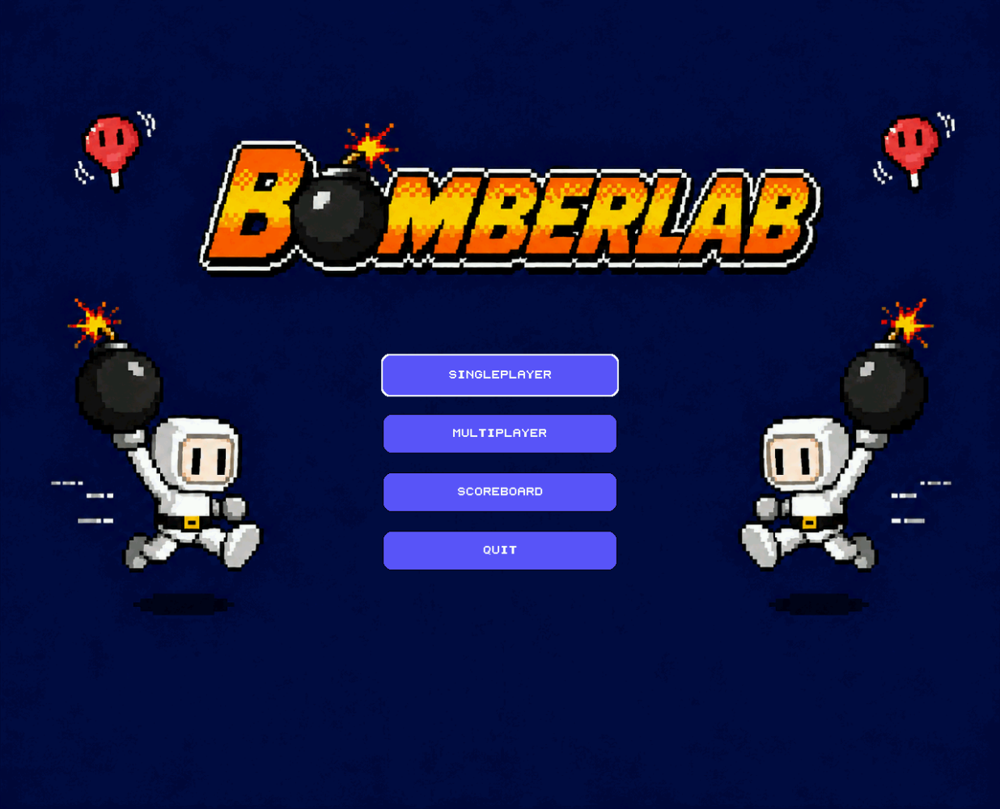
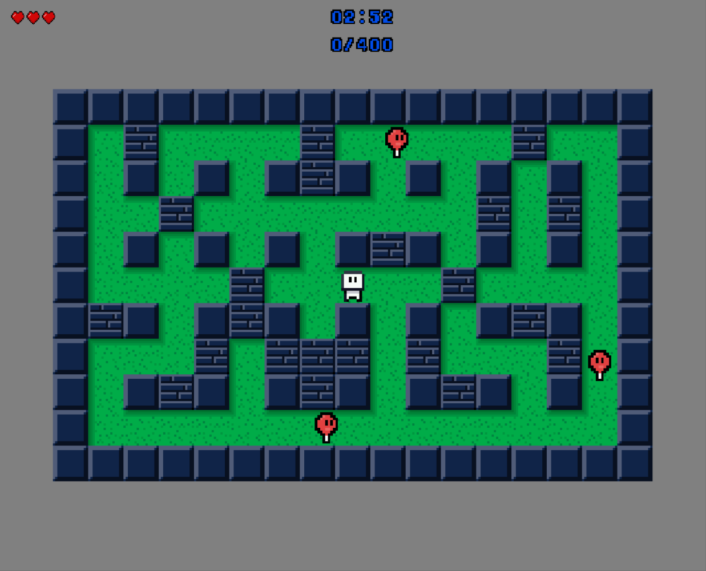
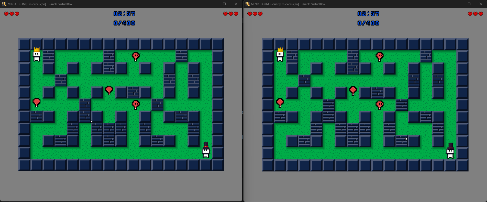
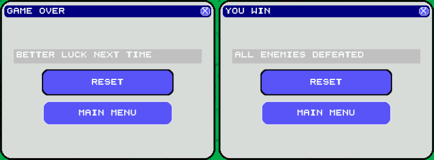
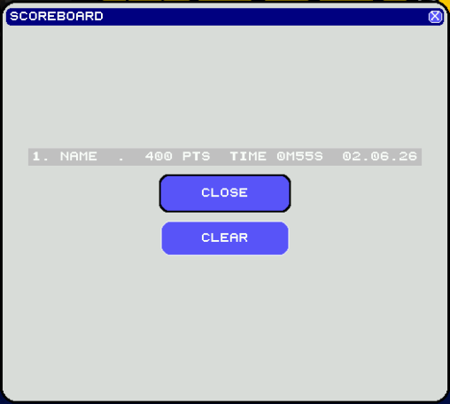

# 💣 BomberLab

> A **Bomberman** implementation for **MINIX 3**, developed as part of the Computer Laboratory course — FEUP.

**Class 5 · Group 3**

| Name | Email | Number |
|------|-------|--------|
| Afonso Sousa | afonso.rocha@outlook.com | up202007585 |
| Dario Amaral | dgamaral2006@gmail.com | up202405681 |
| Tiago Ribeiro | tiagoc8ribeiro@gmail.com | up202404941 |
| Tiago Rocha | tiago.alves.rocha1223@gmail.com | up202407005 |

---

## Table of Contents

- [About the Project](#-about-the-project)
- [Screenshots](#-screenshots)
- [Features](#-features)
- [I/O Devices](#-io-devices)
- [How to Play](#-how-to-play)
- [Build & Run](#-build--run)
- [System Architecture](#-system-architecture)
- [Code Structure](#-code-structure)
- [Data Models](#-data-models)
- [Game Logic](#-game-logic)
- [Multiplayer Protocol](#-multiplayer-protocol)

---

## About the Project

BomberLab is a Bomberman adaptation written entirely in **C** for the **MINIX 3** operating system. The academic goal is to demonstrate correct and integrated use of every I/O peripheral studied throughout the semester — Timer, Keyboard, Mouse, Graphics Card (VBE), RTC, and Serial Port — without relying on any high-level abstraction.

The game supports both **singleplayer** and **multiplayer** modes (two players on separate VMs connected via Serial Port). The map is generated **deterministically** from the current date read from the RTC, guaranteeing that the same calendar day always produces the same map.

---

## Screenshots

### Main Menu
 

---

### Singleplayer — Gameplay


---

### Multiplayer — Two VMs simultaneously
 

---

### Power-ups


---

### Game Over / Victory


---

### Scoreboard


---

## Features

| Feature | Devices | 
|---|---|
| Singleplayer mode | Mouse, Keyboard, Timer, RTC, VBE | 
| Multiplayer mode (2 players) | Mouse, Keyboard, Timer, RTC, VBE, Serial Port |
| Deterministic map generation by date | RTC | 
| Destructible bricks and indestructible walls | VBE | 
| Hidden door under a brick, revealed by explosion | VBE, Timer | 
| Bombs: fuse, animation, explosion and damage | Keyboard, Timer, VBE | 
| Blast range power-up (crown) | VBE | 
| Bomb count power-up (hat) | VBE | 
| Bomb drag power-up (mouse) | Mouse, VBE | 
| Player, enemy, menu and overlay animations | VBE, Timer | 
| Enemy AI with random movement | Timer |
| Dynamic enemy spawning (singleplayer) | Timer | 
| Persistent scoreboard stored to file | RTC, Timer | 
| Pause, reset and return to menu | Mouse, Keyboard |
| Debug overlay and logging | VBE |

---

## I/O Devices

### Mouse
The mouse is used to navigate menus (left-click on buttons) and, in singleplayer, the number of clicks before starting determines the player's spawn point. The controller processes mouse interrupts, synchronising the 3 bytes of each packet before interpreting position and button state. With the drag power-up active, the player can drag already-placed bombs to new positions.

### Keyboard
The keyboard is used both for menu navigation (Tab) and for in-game player control:

| Key | Action |
|-----|--------|
| `W` `A` `S` `D` | Movement (up, left, down, right) |
| `Space` | Place bomb |
| `ESC` | Pause / Resume |
| `Tab` `Shift + Tab` | Navigate menus |

Processing is done via the **make codes** and **break codes** generated by each key, with multi-key support through `movement_stack[4]`.

### Timer
Timer 0 is the central synchronisation axis of the system. It runs at **60 Hz** and is responsible for:
- Controlling the **frame rate** (the screen is updated 60 times per second via double buffering)
- Managing the match **countdown** (180 seconds)
- Synchronising the **data transmission cadence** over the Serial Port in multiplayer
- Controlling all internal timers (bomb fuse, invincibility, animations)

### RTC
The RTC is read at the start of each match to obtain the current date and time. The date (year, month, day) is used as a seed for deterministic map generation — the same day always produces the same board. In singleplayer, the seconds of the day contribute to a second seed that changes every 10 seconds, diversifying enemy positioning. The RTC is also used in the Scoreboard to timestamp entries.

### Video Graphics (VBE)
 
All rendering is done in **VBE 0x11A** graphics mode (resolution **1280×1024** pixels, 16-bit colour in RGB 5-6-5 format). The mode is set via a BIOS interrupt with the linear framebuffer flag enabled, and video memory is mapped into the process's address space using `sys_privctl` + `vm_map_phys`.
 
**Three-buffer architecture.** Rather than a simple double buffer, the driver maintains three distinct memory regions:
 
- `fast_buffer` — a `calloc`'d off-screen region in regular RAM where every frame is fully composed. All drawing primitives write exclusively here.
- `frame_buffer` — the first page of VRAM, mapped at the card's physical base address.
- `double_buffer` — the second page of VRAM, mapped immediately after. This is the hidden page that receives the next frame.
At the end of each tick, `hw_vbe_flip_buffer` copies `fast_buffer → double_buffer` via `memcpy`, then issues BIOS call `0x4F07` (Set Display Start) to toggle the hardware's scanout between Y=0 and Y=screen_height — page-flipping with zero tearing.
 
**Drawing primitives** all target `fast_buffer`: `draw_hline` uses typed pointer casting (`uint32_t*`/`uint16_t*`) for fast multi-pixel writes; `draw_rect` draws the first scanline then `memcpy`s it downwards; `clear_screen` does the same, or a plain `memset` for black.
 
**Sprite rendering.** All sprites are **XPM** files loaded in `XPM_5_6_5` format. A global `sprite_cache[]` holds originals; a parallel `scaled_sprite_cache[]` holds versions pre-scaled to `tile_size`, so scaling only runs once at match init. Three draw modes are supported: native resolution, **nearest-neighbour scaling**, and **90°/180°/270° rotation** with an even-dimension centre correction.
 
**Pixel-art text.** There is no system font — all in-game text (HUD, scoreboard, menus) is rendered via `glyphs.c`, which maps each ASCII character to a hand-crafted XPM glyph.
 
### Serial Port
 
The Serial Port driver targets the **8250/16550 UART** on `COM1` (`0x3F8`). Initialisation configures the line for **8 data bits, 1 stop bit, no parity** and a **baud rate of 9600 bps** — set by writing the divisor latch into DLM/DLL after raising the `DLAB` bit in LCR. The FIFO is enabled via FCR, and MCR is set to `DTR | RTS | OUT2`.
 
**Polling, not interrupts.** Both TX and RX are polled. `serial_send_byte` spins on the LSR `THR_EMPTY` flag before writing; `serial_has_byte` checks LSR `DATA_READY` and is called on every timer tick (60 Hz). `serial_flush_rx` drains stale bytes from the RX FIFO at session start.
 
**Integration with the game loop.** On every timer interrupt, if a byte is available it is fed to the packet assembler in `mp_receive.c`, which accumulates bytes until a complete 5-byte packet is ready, then dispatches it. Outgoing packets are sent byte-by-byte via `serial_send_byte`. A `MP_PACKET_PING` keepalive is transmitted at a fixed interval to detect peer disconnection.
 
---

## How to Play

### Main Menu
On startup, the menu presents 4 options. You can navigate with the **mouse** (left-click) or the **keyboard** (Tab / [Shift + Tab] + Enter).

### Singleplayer
1. Select **Singleplayer** from the menu.
2. Enter a player name and click **Start**.
3. The map is generated based on the current date. The number of mouse clicks before clicking Start determines your spawn point.
4. Use **WASD** to move and **Space** to place bombs.
5. Destroy bricks with bombs to uncover the hidden door and power-ups.
6. The goal is to reach **400 points** (by eliminating enemies) and enter the door before the time limit (3 minutes) runs out.
7. Throughout the match, new enemies may appear periodically — each with a 50% chance of having double speed.

### Multiplayer
1. Connect both VMs via Serial Port.
2. Both players select **Multiplayer** — one VM waits and the other connects.
3. After connecting, each player enters their name.
4. The map and enemies are generated synchronously using the same seed on both VMs.
5. **Player 1** spawns at the top-left corner `(1, 1)`, **Player 2** at the bottom-right corner `(COLS-2, ROWS-2)`.
6. Players collaborate to eliminate enemies and reach the door.

### Power-ups

| Power-up | Sprite | Effect |
|----------|--------|--------|
| Crown (REACH) |  | Increases bomb blast radius  |
| Hat (COUNT) |  | Increases the maximum number of simultaneous bombs (+1, max 4) |
| Drag (DRAG) |  | Allows dragging already-placed bombs with the mouse |

### Win / Loss Conditions

| Result | Condition |
|--------|-----------|
| **Victory** | Score ≥ 400 and player enters the open door |
| **Defeat** | Time runs out (180 s) or all lives are lost |

---

## Build & Run

### Requirements
- MINIX 3 with the LCOM environment configured
- Repository cloned to `/home/lcom/labs/project/`

### Build
```bash
cd labs/project
make
```

### Run
```bash
lcom_run proj
```

### Stop (if needed)
```bash
lcom_stop proj
```

### Scoreboard
Scores are saved to:
```
/home/lcom/labs/project/scoreboard.dat
```

---

## System Architecture

```
┌─────────────────────────────────────────────────────────┐
│                        main.c                           │
│         init hardware · subscribe IRQs · event loop     │
└──────────────┬──────────────────────────────────────────┘
               │ notifications
       ┌───────▼────────┐
       │ event_handlers │  handle_timer · handle_keyboard · handle_mouse
       └───────┬────────┘
               │
    ┌──────────▼──────────────────────────────────┐
    │              t_ctx  (application.h)          │
    │  t_gui · t_game_state · t_time · mp fields   │
    └──┬──────────────────────┬───────────────────┘
       │                      │
┌──────▼──────┐        ┌──────▼──────────────────┐
│  GUI Layer  │        │     Game Logic Layer     │
│  gui_menus  │        │   game_controller.c      │
│  gui_game   │        │   player_controller.c    │
│  gui_dialogs│        │   enemy_controller.c     │
│  gui_scoreb.│        │   bomb_controller.c      │
└──────┬──────┘        │   entity_controller.c    │
       │               │   board_generator.c      │
┌──────▼──────┐        └──────────────────────────┘
│ View Layer  │
│ draw_game   │        ┌──────────────────────────┐
│ draw_player │        │    Hardware Drivers       │
│ draw_enemy  │        │  keyboard · mouse · timer │
│ draw_bombs  │        │  rtc · vbe · serial_port  │
│ draw_map    │        └──────────────────────────┘
│ draw_hud    │
└─────────────┘        ┌──────────────────────────┐
                       │   Multiplayer Layer       │
                       │  mp_protocol · mp_send    │
                       │  mp_receive · mp_session  │
                       └──────────────────────────┘
```

### Tick Flow (60 Hz)

```
Timer IRQ (60 Hz)
  └─► game_state_update(ctx)
        ├─► [players]  invincibility · enemy collision · movement · animation · power-up pickup
        ├─► [enemies]  movement · animation · AI (choose_direction)
        ├─► [bombs]    fuse → BLINK → explosion → damage → cleanup
        ├─► enemy spawn (singleplayer only, every 600 ticks / 10s)
        ├─► player_bomb_count (updates bomb_available per player)
        └─► end conditions: timeout · players_alive==0 → LOST  |  score≥400 + door → WON
```

---

## Code Structure

```
project/
├── Makefile
├── include/
│   ├── core/
│   │   ├── application.h       # t_ctx — global application context
│   │   ├── event_handlers.h    # IRQ handlers
│   │   ├── hardware.h
│   │   └── macros.h
│   ├── game/
│   │   ├── game.h              # game controller public interface
│   │   ├── board_generator.h
│   │   ├── bomb_controller.h
│   │   ├── enemy_controller.h
│   │   ├── entity_controller.h
│   │   ├── map_helpers.h
│   │   └── player_controller.h
│   ├── models/
│   │   ├── types.h             # t_tuple, direction_t, match_state_t
│   │   ├── entity.h            # entity_t (player_t / enemy_t)
│   │   ├── bomb.h              # bomb_t and constants
│   │   ├── board.h             # dimensions and tile types
│   │   ├── game_state.h        # t_game_state
│   │   ├── gui_state.h
│   │   └── score.h
│   ├── multiplayer/
│   │   ├── mp_protocol.h       # packet constants and types
│   │   └── multiplayer.h
│   ├── gui/
│   │   ├── gui.h
│   │   ├── gui_scoreboard.h
│   │   └── widget.h
│   ├── view/
│   │   ├── assets.h / assets_cache.h
│   │   ├── assets_player.h / assets_enemy.h / assets_background.h
│   │   ├── draw.h / glyphs.h
│   │   └── game/               # draw_game, draw_player, draw_enemy, ...
│   └── time/
│       └── app_time.h
├── src/
│   ├── core/
│   │   ├── main.c              # entry point, hardware init, event loop
│   │   ├── event_handlers.c    # handle_timer, handle_keyboard, handle_mouse
│   │   └── debug.c
│   ├── game/
│   │   ├── game_controller.c   # init, reset, update, input handling
│   │   ├── player_controller.c # spawn, movement, animation, death
│   │   ├── enemy_controller.c  # AI, movement, animation
│   │   ├── enemy_spawn.c       # initial and dynamic spawning logic
│   │   ├── bomb_controller.c   # bomb lifecycle
│   │   ├── bombs_explosion_controller.c  # propagation and damage
│   │   ├── entity_controller.c # shared logic (collision, snap, directions)
│   │   ├── board_generator.c   # deterministic map generation
│   │   └── map_helpers.c
│   ├── multiplayer/
│   │   ├── mp_protocol.c       # packet sending
│   │   ├── mp_send.c           # serialisation and state sending
│   │   ├── mp_receive.c        # packet reception and interpretation
│   │   └── mp_session.c        # handshake and session management
│   ├── gui/
│   │   ├── gui_menus.c         # main menu and submenus
│   │   ├── gui_game.c          # game overlay (pause, game over, you win)
│   │   ├── gui_dialogs.c       # dialogs (enter name, connecting, waiting)
│   │   ├── gui_scoreboard.c    # scoreboard screen
│   │   └── gui_widget_*.c      # reusable widget system
│   ├── view/
│   │   ├── draw.c              # drawing primitives
│   │   ├── assets.c / assets_cache.c   # XPM loading and scaling
│   │   ├── glyphs.c            # pixel-art text rendering
│   │   └── game/               # draw_player, draw_enemy, draw_map, draw_bombs, draw_hud
│   ├── scoreboard/
│   │   └── scoreboard_controller.c
│   └── time/
│       └── app_time.c          # time reading and formatting via RTC
└── lib/
    ├── keyboard/   # keyboard.c + i8042.h
    ├── mouse/      # mouse.c
    ├── timer/      # timer.c + i8254.h
    ├── rtc/        # rtc.c
    ├── vbe/        # vbe.c
    ├── serialPort/ # serial_port.c + i8250.h
    └── utils/      # bitwise.c
```

---

## Data Models

### `t_tuple`
A coordinate pair `(x, y)` in `int32`. Used for both pixel positions (`pos`) and board grid positions (`board_pos`).

### `direction_t`
`enum { DIR_DOWN, DIR_LEFT, DIR_RIGHT, DIR_UP }` — shared by players and enemies.

### `match_state_t`
`enum { MATCH_RUNNING, MATCH_PAUSED, MATCH_WON, MATCH_LOST, MATCH_EXITING }` — controls what is rendered and updated each tick.

### `entity_t` (≡ `player_t` / `enemy_t`)
A single structure shared by both players and enemies, simplifying movement, collision and rendering code.

| Field | Description |
|-------|-------------|
| `pos` / `board_pos` | Pixel position and grid position |
| `dir` / `sprite_dir` | Movement direction and sprite direction |
| `movement_stack[4]` | Multi-key support; last valid key takes priority |
| `speed` | Pixels per tick; fast enemies use `ENEMY_SPEED × 2` |
| `lives` | Remaining lives (starts at 3) |
| `invincibility_timer` | 180 ticks of invincibility after taking damage |
| `powerups` | 1-byte bitmask: reach `bits[0-1]` · count `bits[2-3]` · drag `bit[4]` |
| `bomb_max` / `bomb_available` | Maximum and currently available bomb slots |
| `on_snap` | Callback invoked when the entity aligns to a grid cell (snap-to-grid) |

### `bomb_t`

| State | Description |
|-------|-------------|
| `BOMB_INACTIVE` | Free slot |
| `BOMB_PLACED` | Fuse active (150 ticks) |
| `BOMB_BLINK` | Blinking phase (fuse phases 6–8) |
| `BOMB_EXPLODE` | Transition to explosion |
| `BOMB_FIRE` | Active explosion; damage propagated in all 4 directions |

- `radius`: determined by the placing player's REACH power-up level
- `reach[4]`: actual reach in each direction (R/L/D/U), computed in `bomb_begin_explosion` stopping at WALLs
- `explosion_timer`: duration of the FIRE phase

### `t_game_state`
Central structure embedded in `t_ctx`. Contains the board, players, enemies, bombs, score, match state and all timers.

### Board Tile Types (11 × 17)

| Value | Constant | Description |
|-------|----------|-------------|
| `0` | `TILE_TYPE_GRASS` | Free floor |
| `1` | `TILE_TYPE_WALL` | Indestructible wall |
| `2` | `TILE_TYPE_BRICK` | Destructible brick |
| `3` | `TILE_TYPE_DOOR` | Exit door |
| `4` | `TILE_TYPE_POWERUP_REACH` | Blast range power-up |
| `5` | `TILE_TYPE_POWERUP_COUNT` | Bomb count power-up |
| `6` | `TILE_TYPE_POWERUP_DRAG` | Bomb drag power-up |

---

## Game Logic

### Map Generation (`board_generator.c`)

The map is generated deterministically using two seeds read from the RTC:

```c
// Board seed — changes once per day
first_seed = year * 10000 + month * 100 + day;

// Enemy seed (singleplayer) — changes every 10 seconds
second_seed = year * 1000000 + month * 10000 + day * 100 + total_seconds / 10;
```

In multiplayer, the enemy seed is shared over the Serial Port (`enemy_seed`) to guarantee synchronisation between both VMs.

The algorithm for building the board works as follows:

1. **Outer border** — every cell on the perimeter is set to `TILE_TYPE_WALL`, forming an indestructible boundary.
2. **Fixed pillar grid** — within the inner area, every cell at an odd row *and* odd column is set to `TILE_TYPE_WALL`. This creates the classic evenly-spaced pillar pattern that characterises the Bomberman layout.
3. **Random brick placement** — for each remaining `TILE_TYPE_GRASS` cell, a brick is placed with **30% probability**. Before committing, the generator runs a **BFS connectivity check** (`isBoardValid`) from the top-left inner cell: if placing that brick would disconnect any reachable grass cell from the rest of the open area, the placement is rejected and the cell stays as grass. This guarantees the map is always fully connected and explorable.
4. **Door placement** — once the board is finalised, `door_spawnpoint_generator` collects all brick positions and picks one at random (using the seeded RNG). The door tile is hidden underneath it and only revealed when the brick is destroyed by a bomb explosion.

### Player Spawn

- **Singleplayer**: the spawn point is determined by `click_count` — the number of mouse clicks made before pressing Start. Starting from the board centre, the algorithm walks through free cells alternating direction: if `click_count` is odd, `spawn = centre − click_count`; if even, `spawn = centre + click_count`. This makes each player's starting position subtly unique based on their pre-game interaction with the menu.
- **Multiplayer**: Player 1 always spawns at `(1, 1)` and Player 2 at `(COLS-2, ROWS-2)` — the top-left and bottom-right corners respectively.

### Enemy Spawn

- **Singleplayer** (`spawn_enemies_singleplayer`): a **BFS** is run from the player's spawn position, computing the shortest walkable distance to every free cell on the board. Only cells at a distance of at least `MIN_DIST_FROM_PLAYER` qualify as spawn candidates, ensuring enemies never start directly adjacent to the player. The desired number of enemies is then spread evenly across the candidate list using a deterministic offset derived from the player's coordinates — `offset = (player.x * 31 + player.y * 17) % n_candidates` — so that the distribution changes with each different spawn point while remaining reproducible given the same seed.

- **Multiplayer** (`spawn_enemies_multiplayer`): since both players always start in opposite corners, enemies are placed in the **centre of the board** instead. The algorithm collects all free cells whose Manhattan distance from the board centre satisfies `|dx| + |dy| ≤ MULTIPLAYER_ENEMY_SPAWN_RADIUS`. It then picks positions at random from this pool using a shuffle-without-replacement approach (swap-with-last), so no two enemies share a cell.

### Enemy AI (`enemy_controller.c`)
Every 30 ticks, `choose_enemy_direction` decides the next direction:
- **5% probability** of reversing the current direction (prevents looping)
- Otherwise, a random valid direction is chosen, excluding the directly opposite direction
- If the only available option is the reverse direction, the enemy turns around

### Dynamic Enemy Spawning (Singleplayer)
A singleplayer-exclusive feature: every 600 ticks the game attempts to spawn an enemy in a free slot in `enemies[]`. If no free slots or valid positions exist, no enemy is spawned. Each new enemy has a **50% chance of having double speed**.

### Bombs (`bomb_controller.c`)
1. `place_player_bomb`: only places a bomb if `bomb_available > 0` and the cell is free
2. `bomb_update`: manages the fuse timer; activates BLINK at phases ≥ 6/8
3. `bomb_begin_explosion`: propagates `reach[]` in 4 directions, stopping at WALLs or after destroying a BRICK; applies damage to entities in the blast area
4. `bomb_update_explosion`: during FIRE applies damage per tick; clears the slot with `bomb_reset` when finished

### Win / Loss Conditions
| Result | Condition |
|--------|-----------|
| `MATCH_LOST` | `elapsed ≥ 180 s` or `players_alive == 0` → `animation_timer = 5 s` |
| `MATCH_WON` | `score ≥ 400` and player on `door_pos` → `door_open = true` · `animation_timer = 3 s` |
| Multiplayer WON | Door only opens when ≤ 1 active enemy remains |

---

## Scoreboard (`scoreboard_controller.c`)
 
The scoreboard persists results across sessions in a binary file (`scoreboard.dat`) at the project root. It is **loaded on application startup** and **saved automatically** whenever a singleplayer match ends in victory, or when the application exits cleanly.
 
Each entry records:
 
| Field | Description |
|-------|-------------|
| `player_name` | Name entered before the match (up to 31 chars) |
| `score` | Final score (points earned by eliminating enemies) |
| `duration_ticks` | Match duration in timer ticks — used as a tiebreaker |
| `day` / `month` / `year` | Date of the run, read from the **RTC** at submission time |
 
**Ranking logic.** Entries are sorted by score descending; equal scores are broken by `duration_ticks` ascending (faster wins count more). If a player submits a new run, their existing entry is only updated if the new score beats it (or matches it with a shorter duration) — one entry per player name. Once the table reaches `SCOREBOARD_MAX_ENTRIES`, a new run must outscore the last-place entry to displace it.
 
---

## Multiplayer Protocol

Communication between VMs uses **5-byte packets**:

```
[ 0xA5 | TYPE | DATA_0 | DATA_1 | DATA_2 ]
  start  type   payload (3 bytes)
```

| Type | Value | Description |
|------|-------|-------------|
| `MP_PACKET_HELLO` | `0x01` | Presence announcement (handshake) |
| `MP_PACKET_KEY` | `0x02` | Key pressed/released by the remote player |
| `MP_PACKET_PLAYER_STATE` | `0x03` | Player state (lives, power-ups, active) |
| `MP_PACKET_PAUSE` | `0x04` | Pause request |
| `MP_PACKET_READY` | `0x05` | Player ready to start |
| `MP_PACKET_START_GAME` | `0x06` | Game start confirmation + enemy seed |
| `MP_PACKET_NAME_PART` | `0x07` | Fragment of the player's name |
| `MP_PACKET_CANCEL` | `0x08` | Connection cancellation |
| `MP_PACKET_PING` | `0x09` | Keepalive to detect disconnection |

### Handshake
1. Both VMs send `HELLO` on connection
2. The VM that receives first assigns roles (host/guest) using a random nonce as a tiebreaker
3. The host sends `START_GAME` with the `enemy_seed`, ensuring both VMs generate the same enemies
4. Once both confirm `READY`, the game starts simultaneously

During the match, remote keyboard inputs are sent as `MP_PACKET_KEY` and processed locally in `game_state_handle_player_key`, keeping game state synchronised without needing to transmit absolute positions.

---

## Notes & Known Limitations
 
- **MINIX 3 only.** The project relies on MINIX-specific system calls and the LCOM framework. It will not compile or run on Linux or any other OS.
- **Single keyboard layout.** Controls are hardcoded to WASD + Space. In multiplayer, Player 2 uses the same keys on their own VM, so there is no conflict.
- **Multiplayer requires a direct null-modem serial connection** (or the equivalent VM serial port bridge). Network play is not supported.
- **Sprite scaling is nearest-neighbour.** This is intentional — it preserves the pixel-art aesthetic at any resolution, and is fast enough to run comfortably within the 60 Hz budget on MINIX 3 hardware.

---
 
*BomberLab — FEUP, Computer Laboratory 2025/2026*
